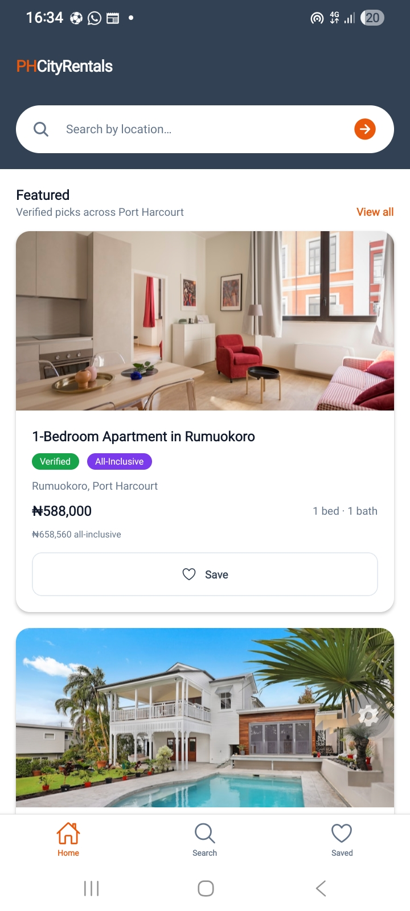
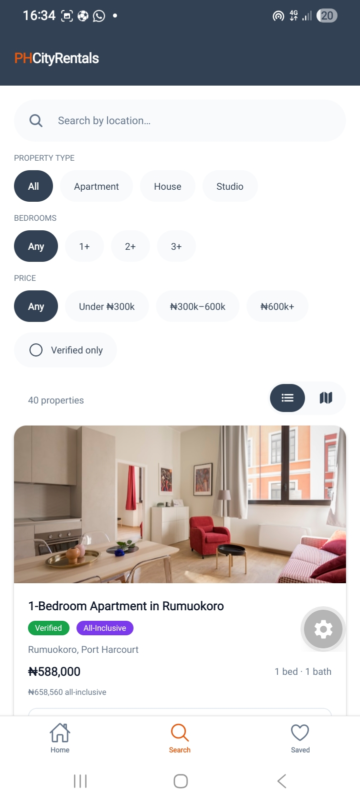
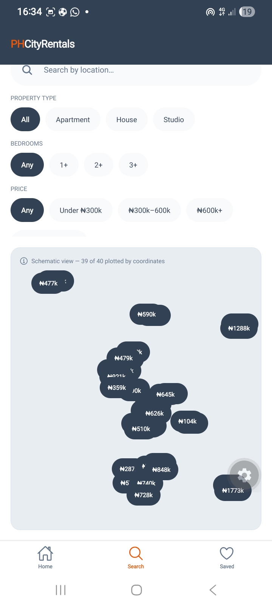
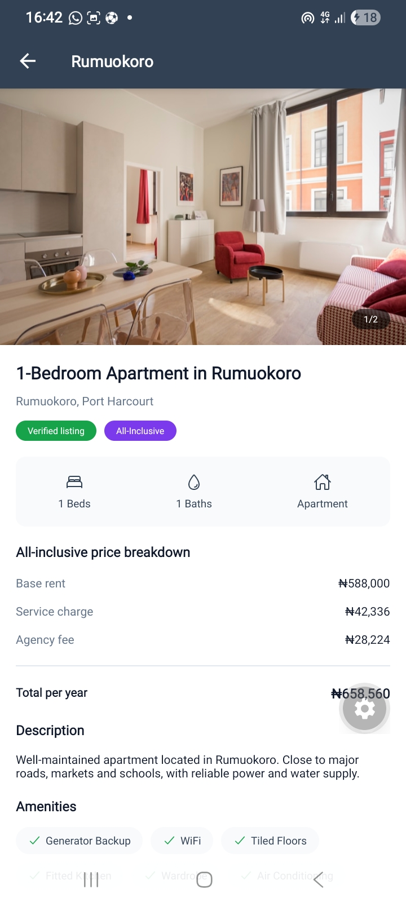
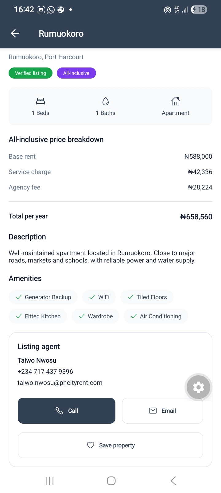
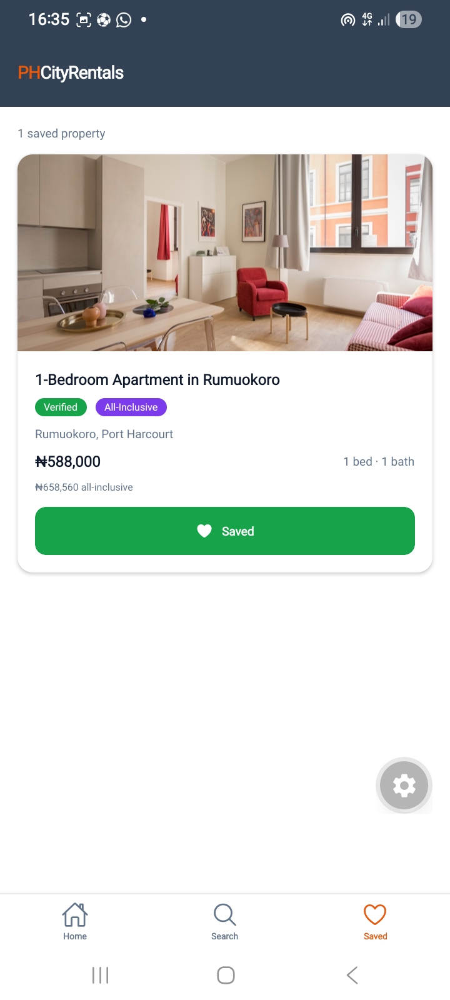

# PHCityRentals — Mobile

A React Native app for discovering verified rental properties in Port Harcourt. Search by
location and budget, browse results as a list or on a map, inspect a property in detail, and
save the ones worth coming back to.

Built with Expo and TypeScript for the PHCityRent Mobile Engineer take-home assessment.

---

## Running it

No API keys, no accounts, no native build required. **Node.js 20.19.4 or newer** (developed on 24.21).

```bash
git clone https://github.com/akadirishogo/phcityrental-mobile.git
cd phcityrental-mobile
npm install
npx expo start
```

Then choose whichever is easiest for you:

| Option | What to do | Needs |
|---|---|---|
| **Physical device** — recommended | Scan the QR code in your terminal | The free **Expo Go** app |
| **Browser** | Press `w` | Nothing |
| **iOS Simulator** | Press `i` | Xcode |
| **Android Emulator** | Press `a` | Android Studio |

The app stays entirely within managed Expo Go — no custom native modules — specifically so
it can be run without a native toolchain.

```bash
npm test     # 17 tests
```

---

## What it does

**Home** — a persistent search bar that stays fixed while featured verified properties scroll
beneath it. Submitting a location hands off to the Search screen.

**Search** — filter by location (debounced as you type), price band, bedrooms, property type
and verified status. Results render as a virtualised list, or as a map mode showing the same
filtered set plotted by coordinate.

**Property details** — swipeable photo gallery with a position counter, a full all-inclusive
price breakdown, amenities, verification status, and agent contact that opens the phone
dialler or mail client.

**Saved** — save or unsave from any screen. Choices persist across app restarts.

Pull-to-refresh works on both list screens.

---

## Screenshots

| Home | Search | Map mode |
|---|---|---|
|  |  |  |

| Property details | Price breakdown | Saved |
|---|---|---|
|  |  |  |

Empty state when nothing has been saved yet:


---

## Stack

| Concern | Choice |
|---|---|
| Framework | React Native 0.86, Expo SDK 57, TypeScript |
| Navigation | Expo Router — file-based routing |
| Server state | TanStack React Query 5 |
| Persistence | AsyncStorage |
| Images | `expo-image` |
| Icons | `@expo/vector-icons` |
| Data | Static TypeScript mock — 40 properties |
| Tests | Vitest |

---

## Architecture

```
src/
├── core/              Domain layer — deliberately free of React, React Native and DOM
│   ├── types.ts           Property, SearchFilters, PropertyType
│   ├── queryKeys.ts       React Query cache key factory
│   ├── domains/pricing.ts Price breakdown and currency formatting
│   └── mock/properties.ts 40 mock properties
│
├── api/client.ts      The only file that knows where data comes from
│
├── app/               Expo Router — the file path IS the route
│   ├── _layout.tsx        Root stack, providers
│   ├── (tabs)/
│   │   ├── _layout.tsx    Tab bar
│   │   ├── index.tsx      Home
│   │   ├── search.tsx     Search — list and map modes
│   │   └── saved.tsx      Saved
│   └── property/[id].tsx  Details — outside (tabs) by design
│
├── components/        PropertyCard, PropertyImage, PropertyMapView, Wordmark
├── features/          useProperties, useProperty, SavedPropertiesProvider
├── hooks/             useDebouncedValue
└── theme.ts           Colour, spacing, radius and type tokens
```

### Navigation hierarchy comes from file placement

`(tabs)` is a route group — the parentheses organise files without adding a URL segment, so
`(tabs)/search.tsx` is the route `/search`. Those three screens share a tab bar.

`property/[id].tsx` sits **outside** that group deliberately. Being a sibling of the tab group
rather than a member of it is what makes a property push over the tab bar as a full screen
with a native back button, instead of rendering inside whichever tab you came from. The
correct back behaviour is a consequence of where the file lives, not of any code.

### The domain layer is platform-agnostic on purpose

Nothing in `core/` or `api/` imports React, React Native or any browser API. They are plain
TypeScript: types, pricing rules, cache keys, mock data and the data client.

That boundary is **verified, not assumed** — the test suite runs in a Node environment, so
any accidental platform dependency in those layers fails the build rather than surviving to
production. It caught a real bug during development; see the AI disclosure below.

The practical payoff: swapping the mock for a live API means editing `api/client.ts` and
nothing else. Screens, hooks and cache keys are untouched.

### State lives where it belongs

| Kind of state | Where | Why |
|---|---|---|
| Server / async data | React Query | Caching, loading, retry and refetch handled for us |
| Search filters | `useState` in the Search screen | One screen owns them; nothing else needs them |
| Saved properties | Context + AsyncStorage | Read and written from four screens, must survive restart |
| Transient UI — image index, view mode | Local `useState` | Never outlives its component |

Only saved-properties is global, and it has to be: **Expo Router keeps tab screens mounted**,
so independent hook instances would drift the moment you saved on one tab and switched to
another. Everything else stays local.

### Performance

`FlatList` throughout, so only visible rows render. `PropertyCard` is wrapped in `memo`, and
`toggleSave` accepts an id rather than being a per-row closure — a fresh arrow function on
every render would change the prop identity and defeat memoisation entirely. The location
filter is debounced so typing doesn't fire a query per keystroke.

### Room for what comes next

- **Authentication** — `SavedPropertiesProvider` is the seam. Swap AsyncStorage for
  authenticated calls and nothing above it changes.
- **Secure tokens** — AsyncStorage holds only saved property IDs, which are non-sensitive.
  Auth tokens would belong in `expo-secure-store`, not here.
- **Push notifications** — no competing root provider, so `expo-notifications` slots into
  `app/_layout.tsx` beside the existing ones.

---

## Handling the awkward cases

| Case | Behaviour |
|---|---|
| Property with no images | Neutral "No photo available" placeholder |
| Image URL that fails to download | Same placeholder, tracked per URL so a different image is still attempted |
| Property with no coordinates | Omitted from the map but still listed; the map caption reports how many are plotted |
| Missing description | Explanatory fallback text |
| Very long titles and addresses | Clamped with `numberOfLines`; full text stays available to screen readers |
| No search results | Empty state with guidance on what to change |
| No saved properties | Empty state, shown only once AsyncStorage has actually loaded |
| Request failure | Error state with a retry button |

The mock data includes these deliberately: properties 7 and 23 have no images, 31 has no
coordinates, 12 has no description, and 4 and 19 have very long titles. They are there so the
handling can be seen rather than claimed.

---

## Testing

```bash
npm test
```

**17 tests, 2 files, all passing.**

| File | Covers |
|---|---|
| `src/core/domains/pricing.test.ts` | Breakdown composition; the invariant that displayed lines sum to the displayed total; that this holds across all 40 properties; currency formatting |
| `src/api/client.test.ts` | Each filter in isolation, filters combined, case-insensitive partial location matching, empty results, single-property lookup including not-found |

**What I chose to test, and why.** Not that components render — that is visible on screen. The
value is in rules that can be quietly wrong: whether a filter actually filters, whether
"3 bedrooms" means exactly three or three-or-more, whether a price breakdown adds up.

---

## Decisions worth explaining

**A designed map mode instead of `react-native-maps`.** The brief permits "a map
implementation, map placeholder, or clearly designed map mode using mocked coordinates." I
took the third. `react-native-maps` needs a Google Maps API key on Android — committing a
credential to a public repository is an automatic red flag — and it pushes the project out of
Expo Go, meaning a reviewer would need Xcode or Android Studio just to open it. The map mode
plots each property by normalising its coordinates against the bounds of the visible result
set, and labels itself a schematic. The spatial relationships are real; the basemap is not.
Pretending otherwise would be worse than saying so.

**Home hands off to Search rather than filtering in place.** The Home search field is
transient — you type, you submit, it's discarded. Search owns the filter state. Two inputs
bound to one concept is a synchronisation bug waiting to be written.

**Chips, not dropdowns.** Six dropdowns is a poor mobile pattern. Horizontal chip rows show
the available options and the current selection at a glance, with no modal in the way.

**Plain `StyleSheet`, no component library.** The brief mandates none. Rather than spend setup
time on one, `theme.ts` holds colour, spacing, radius and type tokens and every screen composes
from it — so visual consistency is structural rather than remembered.

**Saved properties read the mock directly** rather than going through React Query. The saved
IDs are local; hydrating them needs no network call or cache entry. Behind a real API this
becomes its own query hook.

---

## Known limitations

- **No component tests.** Logic is well covered; rendering is not.
- **No offline cache.** React Query holds results in memory only, so a cold start with no
  network shows the error state. `@tanstack/query-async-storage-persister` would address it.
- **The map is schematic.** No panning, zooming or clustering.
- **Saving has no pending or failure state,** because AsyncStorage writes are effectively
  instant and there is nothing to wait on. Behind an API this becomes an optimistic mutation
  with rollback — the provider is already the right place for it.
- **Pull-to-refresh is absent from Saved,** which reads local storage rather than a query.
  There is nothing to refetch.
- **Expo Router's typed-route generation** picks up non-route modules under `src/`, producing
  spurious entries in the generated types. Cosmetic; properly fixed by moving shared code
  outside the router's scan path.
- **Not verified on a physical iOS device.** Tested on Android via Expo Go and in the browser.

---

## With more time

1. Component tests with `jest-expo`, covering the save flow and filter interactions end to end.
2. Offline persistence for React Query, so a cold start can serve cached results.
3. A real map behind an environment-injected key, with clustering — once key management exists
   and the app has moved beyond Expo Go.
4. Skeleton placeholders matching the card layout, instead of spinners.
5. Reanimated transitions on the gallery and card presses.
6. A screen-reader pass on both platforms. Labels and touch targets are in place but have not
   been verified with VoiceOver or TalkBack.

---

## AI disclosure

**Tool used:** Claude (Anthropic), via Claude Code, throughout the build.

**In short:** I directed the architecture and made every product and layout decision.
Implementation and debugging were AI-assisted. I reviewed every change and can explain and
modify any part of this codebase.

### What I determined

The project structure is mine — the `core/ / api/ / features/ / components/` separation, and
the rule that `core/` and `api/` stay free of React, React Native and DOM imports so the
domain layer is portable and testable on its own.

So are the product and interface decisions:

- A schematic map mode rather than `react-native-maps`, so the app stays runnable in Expo Go
  with no API key committed to a public repository
- Home handing off to Search rather than filtering in place, so one screen owns filter state
- Replacing a non-interactive search pill with a real submitting input, because a control that
  looks like a field should behave like one
- Removing a property-type category row from Home as redundant with Search's own filters
- A persistent hero, so the search bar never scrolls out of reach, then trimming its height
  once it earned less space than it took
- Chips rather than dropdowns for filt          ers
- Moving the list/map toggle out of the filter panel, because a control that changes a view
  must not live inside the thing it changes

### What was AI-assisted

Implementations And Debugging.


### Shared domain layer

`core/` and `api/` were authored earlier, during a web application built in the same period,
and moved here without modification. That portability was the design goal, and it held — not
a line needed changing.

### Bugs the process surfaced

- A browser-only `window.location` check had been introduced into the shared API client. The
  Node-environment test suite caught it immediately — a dependency that would have crashed
  this app on its first fetch, and exactly the failure the Node environment exists to detect.
- Several bugs came from code landing incompletely: a `viewMode` state with no toggle wired to
  it, an unused parameter in a marker factory. TypeScript passed both times, because unused
  variables and parameters are legal. Type checking catches wrong types, not missing wiring.
- The list/map toggle initially sat at the bottom of a height-capped scrollable filter panel,
  so switching to map mode hid the control needed to switch back.

## Assumptions

- Rental prices are annual, as is standard in the Nigerian market.
- "All-Inclusive" means the quoted figure already covers base rent, service charge and agency
  fee — so a tenant sees the true cost upfront rather than discovering additions at signing.
- Coordinates are mocked but plausible for the named Port Harcourt neighbourhoods.
- No authentication: saved properties are per-device, held in AsyncStorage.
